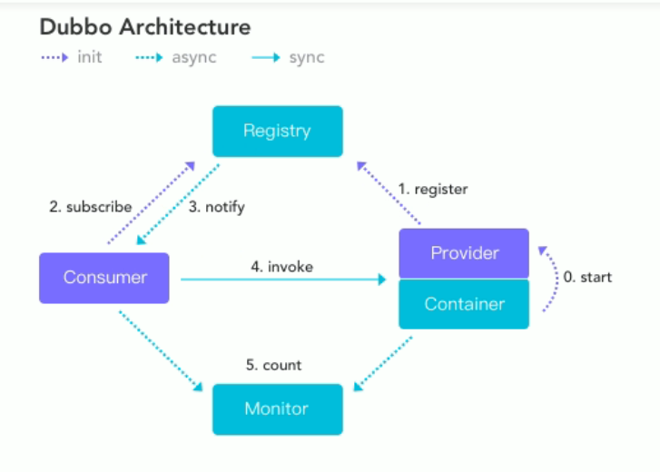

# Dubbo学习笔记

## 基础知识

### 分布式基础理论

`Dubbo`是什么？

是一款易用，高性能的WEB和RPC框架，同时为构造企业级微服务提供服务发现、流量治理、可观测、认证鉴权等能力和工具。

1. 什么是分布式系统？

   《分布式系统原理与模型》定义：

   分布式系统是若干个独立计算机的集合，这些计算机对于用户来说就像单个相关系统。分布式系统是建立在网络之上的软件系统。

2. 发展演变

   - 单一应用架构（All in One）
   - 水平扩展架构 
   - 垂直应用架构（Vertical Application）
   - SOA架构（Service-Oriented Architecture）

3. RPC（Remote Procedure Call）

   影响RPC效率的因素：通信效率，序列化效率

### Dubbo设计架构



## 环境搭建

### 注册中心 ——>`zookeeper`

1. 下载zookeeper

2. 更改`zoo_sample.cfg`->`zoo.cfg`

3. 改写`zoo.cfg`

   （zookeeper新版本启动的过程中，zookeeper新增的审核日志是默认关闭，所以控制台输出`ZooKeeper audit is disabled`）

   ```cfg
   
   tickTime=2000
   initLimit=10
   syncLimit=5
   dataDir=../data
   clientPort=2181
   audit.enable=true
   
   ```

### 监控中心——> `dubbo-admin`

## Dubbo结构

1. provider 功能提供者
2. consumer 功能调用者
3. commons-api 通用内容    entity    service接口
4. registry 注册中心    管理provider集群

## Dubbo基于SpringBoot

`@DubboService` `@DubboResource`

### `@EnableDubbo` 注解的作用

用于扫描`DubboService` 并把对应的对象实例化，并发布成RPC服务

特定目录扫描`DubboService` `@DubboComponentScan(basePackage={"xxx"})`

Dubbo服务配置

```yml
#provider
spring:
  application:
    name: DUBBO-BOOT-PROVIDER
dubbo:
  protocol:
    port: -1
    name: tri #使用grpc方式通信用 tri & grpc
  registry:
    address: zookeeper://${zookeeper.address:127.0.0.1}:2181

```

```yml
#consumer
spring:
  application:
    name: DUBBO-BOOT-CONSUMER

dubbo:
  application:
    qos-enable: false
```

## Dubbo集成protobuf

插件以及依赖

```xml
<!-- 父工程的pom-->
<properties>
        <dubbo.version>3.3.0-beta.1</dubbo.version>
        <junit.version>4.13.1</junit.version>
        <spring-boot.version>2.7.8</spring-boot.version>
        <maven.compiler.source>1.8</maven.compiler.source>
        <maven.compiler.target>1.8</maven.compiler.target>
        <maven.compiler.source>1.8</maven.compiler.source>
        <maven.compiler.target>1.8</maven.compiler.target>
        <source.level>1.8</source.level>
        <target.level>1.8</target.level>
        <grpc.version>1.54.1</grpc.version>
        <maven-compiler-plugin.version>3.7.0</maven-compiler-plugin.version>
        <protoc.version>3.22.3</protoc.version>
        <maven.compiler.source>1.8</maven.compiler.source>
        <maven.compiler.target>1.8</maven.compiler.target>
    </properties>
```

```xml
<!-- proto生成接口的依赖-->
<?xml version="1.0" encoding="UTF-8"?>
<project xmlns="http://maven.apache.org/POM/4.0.0"
         xmlns:xsi="http://www.w3.org/2001/XMLSchema-instance"
         xsi:schemaLocation="http://maven.apache.org/POM/4.0.0 http://maven.apache.org/xsd/maven-4.0.0.xsd">
    <modelVersion>4.0.0</modelVersion>
    <parent>
        <groupId>org.avgkin</groupId>
        <artifactId>dubbo-demo03-protobuf</artifactId>
        <version>1.0-SNAPSHOT</version>
        <relativePath>../pom.xml</relativePath>
    </parent>

    <artifactId>dubbo-protobuf-api</artifactId>

    <properties>
        <maven.compiler.source>17</maven.compiler.source>
        <maven.compiler.target>17</maven.compiler.target>
        <project.build.sourceEncoding>UTF-8</project.build.sourceEncoding>
    </properties>

    <dependencies>
        <!-- protobuf -->
        <dependency>
            <groupId>com.google.protobuf</groupId>
            <artifactId>protobuf-java</artifactId>
            <version>3.19.6</version>
        </dependency>
    </dependencies>

    <build>
        <plugins>
            <plugin>
                <groupId>org.xolstice.maven.plugins</groupId>
                <artifactId>protobuf-maven-plugin</artifactId>
                <version>0.6.1</version>
                <configuration>
                    <protocArtifact>com.google.protobuf:protoc:${protoc.version}:exe:${os.detected.classifier}</protocArtifact>
                    <protocPlugins>
                        <protocPlugin>
                            <id>dubbo</id>
                            <groupId>org.apache.dubbo</groupId>
                            <artifactId>dubbo-compiler</artifactId>
                            <version>${dubbo.version}</version>
                            <mainClass>org.apache.dubbo.gen.tri.Dubbo3TripleGenerator</mainClass>
                        </protocPlugin>
                    </protocPlugins>
                </configuration>
                <executions>
                    <execution>
                        <goals>
                            <goal>compile</goal>
                        </goals>
                    </execution>
                </executions>
            </plugin>
        </plugins>
    </build>


</project>
```

```xml
<!-- provider的依赖-->
<?xml version="1.0" encoding="UTF-8"?>
<project xmlns="http://maven.apache.org/POM/4.0.0" xmlns:xsi="http://www.w3.org/2001/XMLSchema-instance"
         xsi:schemaLocation="http://maven.apache.org/POM/4.0.0 https://maven.apache.org/xsd/maven-4.0.0.xsd">
    <modelVersion>4.0.0</modelVersion>
    <parent>
        <groupId>org.springframework.boot</groupId>
        <artifactId>spring-boot-starter-parent</artifactId>
        <version>3.1.5</version>
        <relativePath/> <!-- lookup parent from repository -->
    </parent>
    <groupId>com.avgkin</groupId>
    <artifactId>dubbo-protobuf-provider</artifactId>
    <version>0.0.1-SNAPSHOT</version>
    <name>dubbo-protobuf-provider</name>
    <description>dubbo-protobuf-provider</description>
    <properties>
        <java.version>17</java.version>
    </properties>
    <dependencies>
        <dependency>
            <groupId>org.springframework.boot</groupId>
            <artifactId>spring-boot-starter</artifactId>
        </dependency>

        <dependency>
            <groupId>org.springframework.boot</groupId>
            <artifactId>spring-boot-starter-test</artifactId>
            <scope>test</scope>
        </dependency>

        <!-- dubbo -->
        <dependency>
            <groupId>org.apache.dubbo</groupId>
            <artifactId>dubbo-spring-boot-starter</artifactId>
        </dependency>
        <dependency>
            <groupId>org.apache.dubbo</groupId>
            <artifactId>dubbo-zookeeper-curator5-spring-boot-starter</artifactId>
        </dependency>

    </dependencies>

    <build>
        <plugins>
            <plugin>
                <groupId>org.springframework.boot</groupId>
                <artifactId>spring-boot-maven-plugin</artifactId>
            </plugin>
        </plugins>
    </build>

</project>

```

